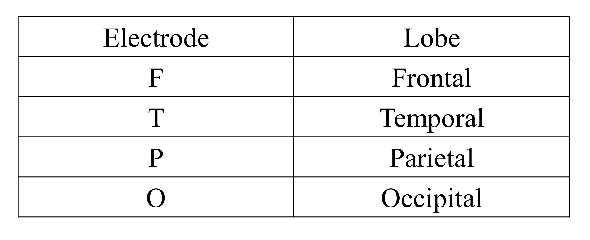
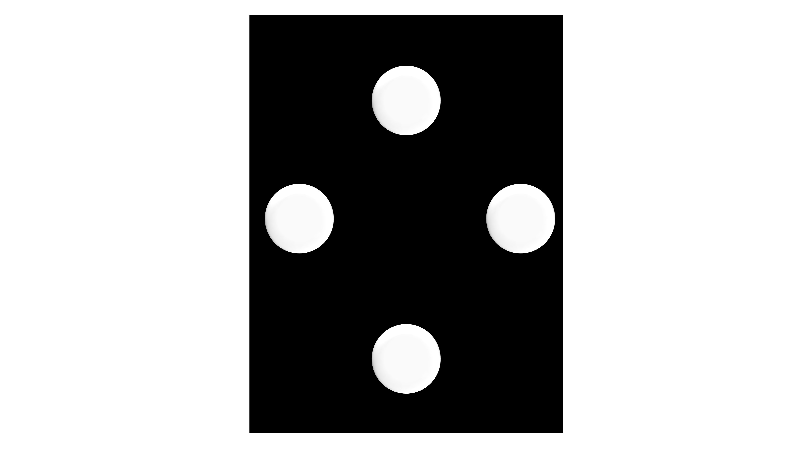

# Brain-Computer-Interface (BCI)
#### Human Brain:

                                         Fig 1: Different regions of a human brain [1]

* The human brain is the command center for the human nervous system
* It receives input from the sensory organs and sends output to the muscles
* It contains billions of nerve fibers (axons and dendrites)
* These neurons are connected by trillions of connections, or synapses

#### Motivation:

* In a paraplegic patient, the nerves connecting the lower parts of the body are damaged as a result they are unable to move. And in the   case of a tetraplegic patient, the spinal nerves are damaged as a result they are unable to perform motor actions such as walking,       lifting objects, etc.   
* My motivation of work is to be part of a research which can improve the life of the needy persons in the society   
* The aim of BCI lab of RRI is to develop a system to assist paraplegic or tetraplegic patients to carry out different activities.   
* The ultimate noble aim of the lab is to provide low cost devices to physically challenged persons.   
*	This forms a bridge between my interest and the research of this lab.

### Brain Computer Interface (BCI) System:

            
                                         Fig 2: BCI System (SSVEP) Block Diagram
                                            
#### Objective:

* Brain-computer interface (BCI) system is an interface between a brain and a device which enables signals from the brain to direct some   external activity, like, control of an action device such as Robotic arm etc.   
*	The objective is to develop an in-house system to extract and process the signal with minimum amount of time    
*	Perform different actions with a good accuracy and to permit easy customization.
*	BCI offers an alternative to natural communication and acts as a pathway between the brain and the object to be controlled.   
*	A BCI system analyzes the ongoing brain activity by acquiring and processing the brain patterns which originate from specific brain     areas.   
*	To get a consistent recordings of these patterns, it relies on the universal 10-20 electrode position system.   
*	Presently, the type of brain patterns on which, the system is designed mainly based on selective attention. This requires an external   visual stimuli for the user in order to generate the Brain patterns called Steady State Visually Evoked Potential (SSVEP).

#### Steady State Visually Evoked Potentials (SSVEP):

* When the visual stimulus is viewed by a user, the flickering light rays fall on the retina of the eye which is then converted into       electrical signals and transmitted to the occipital lobe of the brain via the optic nerves. The mass of neurons in the occipital lobe   get excited and generate SSVEP signals at the same frequency as that at which the external stimulus light flickers and at its           harmonics as well. 
* A normal SSVEP signal of an intended frequency (12 Hz), in the frequency domain looks like as shown below:

                           Fig 3: FFT plot of SSVEP signal at 12 Hz [2] 
                           
 * SSVEP signals are dominant in the mid-range frequencies i.e., between the 10 –25 Hz, though SSVEP can be generated for frequencies      anywhere between 10-100 Hz.
   
#### Different stages of a BCI system:
   A BCI system comprises of several stages e.g. Signal acquisition, Signal amplification, Signal processing (Feature extraction and        Translation) and sending command to the actuating devices.

#### Signal acquisition:

* This is the first and foremost stage of a BCI system. To acquire good EEG data proper positioning of electrodes is very important.    
* This process of placing electrode is called montaging. For montaging at first, the center point of scalp (Cz) is marked by measuring     the intersection point of longitudinal (Nasion-Inion) and latitudinal (left to right ear lobe) distance of skull. Then the electrodes   are placed at desired positions.   
* For SSVEP form of BCI, the desired position of electrodes are Occipital and Parietal region (usually O1, O2, Oz, PO3, PO4 and POz) of   brain.   
* The marked positions are abraded using Nu prep gel and electrodes are placed using 10-20 electrode paste.   
* There are different types (cup, flower, porcupine, ring electrode etc.) of electrodes available. We are using Ag-AgCl ring electrodes   manufactured by GTec.   
* Reference electrode is mounted over the left or right ear lobe.
* The Drive Right Leg (DRL) is mounted over the bone of the right leg. This helps in reducing the Common Mode signals of 50 Hz Hum by     cancelling them. 

                                      Fig 4: Montage of various Electrodes on Subject [3]
                                     
 * Raw EEG signals has the following signature shown in figure
 
 
 
                                         Fig 5: Raw EEG plot [4]

### 10/20 Electrode Position System:

              Fig 6: 10/20 Electrode Position System [5]

* The 10/20 system is an internationally accepted method to describe the location of scalp electrodes.
* The numbers ‘10’ and ’20’ refer to the distance between adjacent electrodes which are either 10% or 20% of the total nasion-inion       distance or the right pre-auricular (right ear lobe) to left pre-auricular (left ear lobe) distance.
* Nasion -> The point between the forehead and the nose.
  Inion -> The lowest point of the skull from the back of the head, normally indicated by a prominent bump.
  Pre-auricular points -> Anterior to the left and right ear.   
* The electrode positions are denoted by letters and a number. Letters to identify the lobe and the number to identify the hemisphere     location.   

C – Used for identification purpose of central scalp position.
z – Refer to an electrode placed on the mid line.
Even numbers (2, 4, 6, 8) refer to electrode positions on the right hemisphere.
Odd numbers (1, 3, 5, 7) refer to electrode positions on the left hemisphere.

#### Signal amplification:

* The acquired EEG signals are of 10-100 microvolt range, which are very weak to 
  detect and process for the A/D converter. Therefore it has to be massively amplified. 
  The amplifier comprises of Instrumentation amplifier, Band-pass Filter, 50 Hz Notch 
  Filter, Successive gain stages and power supply circuitry.
  
  
  
                                            Fig 7: Signal amplification stages 

* Instrumentation amplifier, amplifies the difference between the signals obtained from 
   the scalp locations through the signal channel and reference channel. It is a high 
   quality differential amplifier (gain factor 200) and its Common Mode Rejection Ratio  
   (CMRR) is set to be high.
   
* Band pass filter is a combination of a High-pass Filter (cut-off frequency of 1 Hz) 
   and a Low-Pass Filter (cut-off frequency of 35 Hz). LPF is used to minimize the 
   distortion and restricting the frequency band of interest to generate SSVEP signals 
   i.e. 1-35 Hz. The HPF is used to remove the DC offset.
   
* 50 Hz Notch Filter is used to reject the 50 Hz noise from the acquired signal in order 
   to improve the quality of the signal.
   
* There are three gain stages. First is the Instrumentation amplifier, second is the 
   variable (gain factor 0 to 255) gain stage and the third stage is of fixed gain (gain 
   factor 12) stage.
   
#### Signal processing:

* The method which is used to process the amplified EEG signals from the Bio-
   amplifier is called Digital Matched Filtering (DMF).
   
* The steps involved in this method is shown (Fig: 9) with a block diagram below.

* To elicit SSVEP signal external stimuli are required. Therefore a stimulus box has 
   been designed using 4 LEDs flickering at different frequencies (anywhere between 
   10 to 18 Hz). These 4 frequencies are subject dependent and identified prior to 
   conducting the experiment. Each frequency is mapped to some action. 
   
   
                                                        
                                                        Fig 8: Stimuli box
                                                      
   * In DMF method, at first the look up tables for sine and cosine waves of 4 different 
   frequencies are generated.

                                        Fig 9: Digital Match Filtering Procedure [6]

* The incoming EEG signals are digitized by using A/D converter of Arduino and used 
   further for processing.
   
* The degree of correlation between the incoming EEG signals (at frequency of LED 
   flickering) and the same frequency sine (and cosine) waves is checked.
   
* The frequency corresponding to the highest correlation value is the intended 
   frequency has been elicited by the user. 
   
* The subject would gaze at the intended LED until the desired action has been  
   performed. The detection time is subject dependent and varies depending on the level 
   of training that the subject has undergone prior to the experiment.

#### SSVEP Frequency Spectrum Plot:

* The SSVEP frequency spectrum can be shown by FFT plot.

* From the FFT plot the Signal to Noise ratio (SNR) can be computed. In the present 
   context SNR refers to the ratio of useful information (signal) to false or irrelevant  
   data (noise). Higher the value of SNR, the more is the desired signal present in the 
   spectrum.

                             Fig 10: Frequency spectrum of SSVEP signal of 15 Hz acquired from   Subject [7]
                             
### Different modes of SSVEP BCI system:

The developed BCI system for SSVEP of RRI comprises of different modes of operation e.g. i) Mode 1-> Frequency Calibration, ii) Mode 2-> SSVEP Training, iii) Mode 3->SSVEP protocol

#### i)	Frequency Calibration: 
It is about finding out best 4 frequencies in 12-30 Hz band prior to conduct the experiment. These 4 frequencies are used for the action selection.

#### ii)	SSVEP Training: 
It is about training with defined protocol with best frequencies. This defines the sequence of 4 actions performed on the flickering of 4 LEDs. In this mode user is trained about at what sequence user has to concentrate on each LED to perform each action by robotic arm, when all are flickering simultaneously.

#### iii)	SSVEP protocol: 
It is about giving commands to robotic arm as per defined protocol. For example when user has focused on LED corresponding to 1st action the arm goes down to grab and pick an object, in 2nd action the arm moves left from the starting position, goes down to place the object at the final position and so on. Finally at the end of the 4th action it comes back to its starting position.

                                              Fig 11: Sequence of actions for SSVEP 
                                              
#### My Role:

I am involved in the coding part for the EEG signal processing as well as robotic arm coding using Arduino IDE. For the display of ongoing frequency, trials and EEG plot a GLCD display has been used. I am involved in the coding of it as well. I have debugged the mode 1 part, where there was an issue with displaying frequency and corresponding trials. At present I am working with the robotic arm to precisely control its position and speed. I am using servo motor shield for this purpose and for the over current protection of the motors as well. When the arm is used with load, backlash is noticed. Therefore I am implementing PID algorithm on it to remove the backlash error.
#### Actuating device:

* The actuating device used in this lab is a robotic arm.

* The arm has 3 degrees of freedom. It can rotate on its base, shoulder and wrist joints.

        Fig 12: Robotic arm [8]  
        
* 4 RC servo motors has been used for movement of base, shoulder, wrist and end- 
   effector respectively.
   
* The sequence of actions for the arm has been programmed in Arduino.

* The arm performs the actions when it gets signals from the processing board via 
   Bluetooth module which has a range of 10 meters.
 
#### Reference:        
[1] https://straitsmoslem.com/2018/02/13/bagaimana-alquran-membentuk-otak/

[2] - [4] Brain Computer Interface laboratory, Raman Research Institute, Bangalore

[5] https://g-se.com/el-biofeedback-y-neurofeedback-como-estrategias-de-     recuperacion-fisica-y-mejoramiento-del-sueno-y-rendimiento-en-deportistas-bp-d57cfb26dea6de 

[6] - [7] Brain Computer Interface laboratory, Raman Research Institute, Bangalore

[8] http://www.instructables.com/id/Arduino-Robot-Arm/

        
